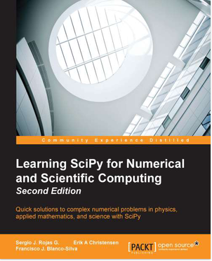

# Learning-Scipy

 <table style="width:100%">
  <tr>
     <td>
         
     </td>
     <td>
This repository contains source code programs and some notes to complement the book about the scientific [Python](https://www.python.org/) module [SciPy](http://www.scipy.org/) entitle [Learning SciPy for Numerical and Scientific Computing - Second Edition (2015)](https://www.packtpub.com/big-data-and-business-intelligence/learning-scipy-numerical-and-scientific-computing-second-edition), of [Pack Publishing](https://www.packtpub.com/) authored by [Sergio J. Rojas G.](http://prof.usb.ve/srojas/), Erik A Christensen,  and [Francisco J. Blanco-Silva](http://blancosilva.github.io/). This repository is maintained by one of the authors, 
[Sergio Rojas](http://prof.usb.ve/srojas/).

The functionality of [SciPy](http://www.scipy.org/) covered in the
aforementioned book can be used as either a complement
for a full course about scientific computing with [Python](https://www.python.org/) or as an
introduction to [Scipy](http://www.scipy.org/).

Consequently, feel free to reuse and/or modify the content presented here for your own teaching needs, though
proper acknowledgement of the source content will be highly appreciated.

As we would like this reference material to be improved over time,
we encourage you to contribute changes or corrections, which will be
reviewed ,edited, and properly acknowledged by the maintainer of this site.
        </td>
  </tr>
</table>
 

The Following web links bring you to the [nbviewer](http://nbviewer.ipython.org/) static (HTML) display corresponding to the respective [IPython notebooks](http://ipython.org/notebook.html) included with each 
chapter of the book (which you could download following each chapter link already shown above):

>> * [**Chapter 1. _Introduction to SciPy_**](http://nbviewer.ipython.org/github/rojassergio/Learning-Scipy/blob/master/Chapter1/7702OS_Chap_01_rev20150118.ipynb)
>> * [**Chapter 2. _Working with Numpy Array as a first step to Scipy_**](http://nbviewer.ipython.org/github/rojassergio/Learning-Scipy/blob/master/Chapter2/7702OS_Chap_02_rev20141229.ipynb)
>> * [**Chapter 3. _SciPy for Linear Algebra_**](http://nbviewer.ipython.org/github/rojassergio/Learning-Scipy/blob/master/Chapter3/7702OS_Chap_03_rev20141229.ipynb)
>> * [**Chapter 4. SciPy for Numerical Analysis_**](http://nbviewer.ipython.org/github/rojassergio/Learning-Scipy/blob/master/Chapter4/7702OS_Chap_04_rev20141230.ipynb)
>> * [**Chapter 5. _SciPy for Signal Processing_**](http://nbviewer.ipython.org/github/rojassergio/Learning-Scipy/blob/master/Chapter5/CHAP_05.ipynb)
>> * [**Chapter 6. _SciPy for Data Mining_**](http://nbviewer.ipython.org/github/rojassergio/Learning-Scipy/blob/master/Chapter6/CHAP_06.ipynb)
>> * [**Chapter 7. _SciPy for Computational Geometry_**](http://nbviewer.ipython.org/github/rojassergio/Learning-Scipy/blob/master/Chapter7/CHAP_07.ipynb)
>> * [**Chapter 8. _Interaction with Other Languages_**](http://nbviewer.ipython.org/github/rojassergio/Learning-Scipy/blob/master/Chapter8/CHAP_08.ipynb)

# Otros archivos en Learning-Scipy

> * [**_An&aacute;lisis Num&eacute;rico y C&oacute;mputo Cient&iacute;fico v&iacute;a el IPython Notebook_**](http://nbviewer.ipython.org/github/rojassergio/Learning-Scipy/blob/master/Other_IPhythonNotes/Numerical_Computing_via_IPython.ipynb)
